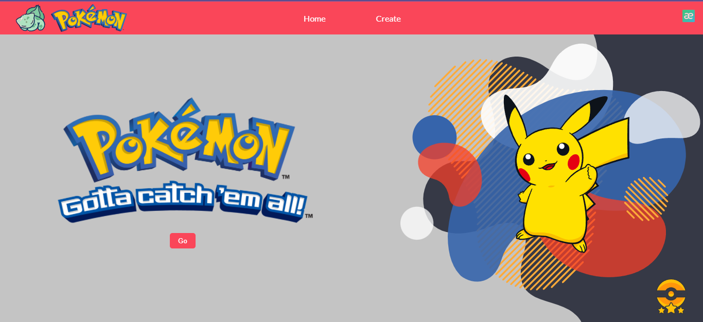
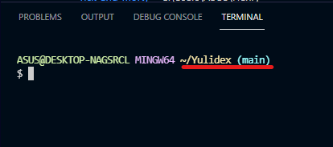

    

# Individual Project - YuliDex - Henry Pokemon

  

## Objetivos del Proyecto

- Construir una App utlizando React, Redux, Node y Sequelize.
- Afirmar y conectar los conceptos aprendidos en la carrera.
- Aprender mejores prácticas.
- Aprender y practicar el workflow de GIT.
- Usar y practicar testing.

## HomePage

Así luce la página de inicio.

Para poder entrar al proyecto tenemos dos opciones, la primera es usarlo desde el deploy y la segunda es usarlo de manera local en tu compu.
**Nota:** para una mejor experiencia recomiendo verlo desde un computador ya que no es responsive.

## Deploy

Puedes ingregar al proyecto con esta url [YuliDex](https://condescending-yalow-c98cf6.netlify.app/)

## Local

Para correr la aplicación de forma local debes seguir los siguientes pasos:

- Descargar el códgio del repositorio; en la parte superior del repo encontrarás un botón que dice código/code dependiendo del idioma, le das click y se despliegan unas opciones, selecionamos Descargar ZIP/Download ZIP.

- Descomprimir la carpeta y abrir con tu editor de código favorito.
- Hacer `npm install` en la terminal. Esto nos va a descargar todos los paquetes necesarios para nuestra aplicación.
- Hacer `npm start`. Esto nos llevará al navegador donde podremos ver la aplicación.

Recuerda estar posicionado sobre la carpeta del proyecto, en este caso debe terminar en /Yulidex

